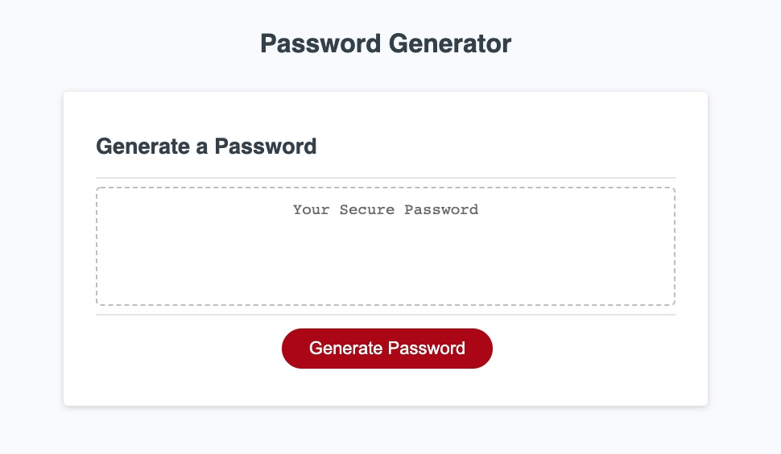

# Lazy Password Web App

Lazy Password is an application to generate random passwords.
This application was built with **Javascript, HTML, and CSS.**

## Here is a screenshot

The criteria for password attributes include length (8-128), uppercase characters, lowercase characters, numbers, and special characters.

To generate, the user can click Generate Password button or press any key on the keyboard. 

The generator uses a series of user prompts to gather attributes. It leverages rando.js to randomize the passwords.

Lazy Password was built by **Dan Evola**

For more info check out my [portfolio](http://dmevola.github.io/portfolio)